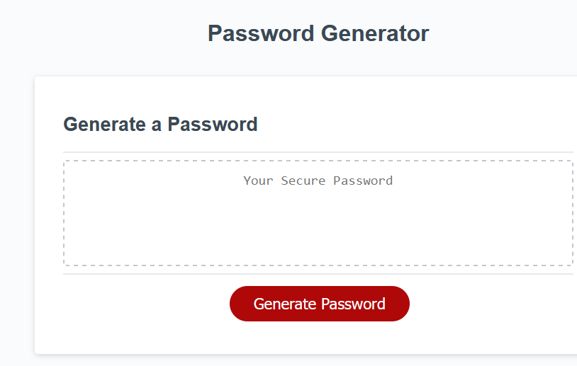
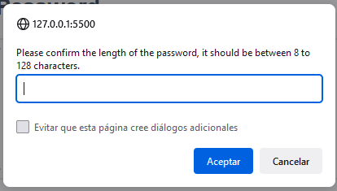
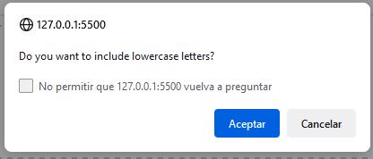
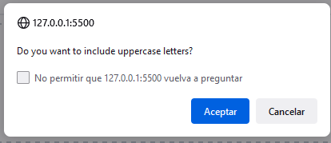
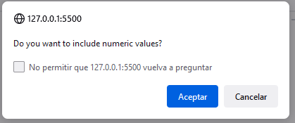
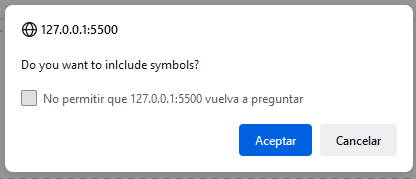
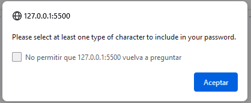
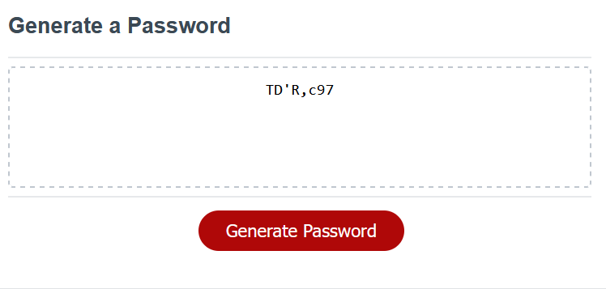

# 🔒 Password Generator Starter Code 🔒

## Table of contents 🚀

* [Introduction](#introduction)
* [Requirements](#requirements)
* [Before we get started](#before-we-get-started)
* [Personal opinion](#personal-opinion)
* [Deployed links](#deployed-links)
* [Credits](#credits)

## Introduction 

This is a simple random password generator that allows users to select the length of their password and the type of characters they want to include.

## How to Use

Click the "Generate Password" button to start the process.

When prompted, enter the desired length of your password, which should be between 8 to 128 characters.

You will then be prompted to select which type of characters you want to include in your password. You can choose to include the following:

* Lowercases 🆒

* Uppercases 🅰️

* Numbers 🔢

* Symbols 🉐

At least one type of character must be selected.

Once you have selected your desired options, your password will be generated and displayed in the "Your Secure Password" box.

## Requirements 

* GitHub 🐱

* Your preferred browser 🌍

* VS code 🆚

* A place to store your password. 🛡️

## Before we get started

Be sure to have somewhere safe to keep the generated password in case that you will be using it in the future.

## Personal opinion

Security is important, that is the reason that we are working really hard to create this random password generator.

## Deployed links

* [GitHub Pages](https://fabri-tech.github.io/Password-generator-Fabrizio-Trevi-o/)

* [Github Repository](https://github.com/Fabri-Tech?tab=repositories)

## Credits

:wolf::wolf: Fabrizio Treviño :wolf::wolf:
